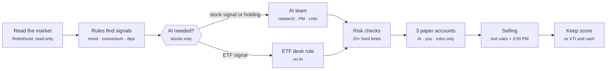

# How it works: the Agent Desk

_Generated from `agents/desk/guide_content.py` (same source as the dashboard page **How it works**, `/guide`). Rules as of 2026-09-30 (rules effective 2026-10-01 09:30 ET)._

A paper-trading research desk. Every weekday it reads the market from a Robinhood connection that can only read, follows written rules to decide what to buy and sell, asks a small team of AI models for a second opinion only on individual stocks, checks every trade against hard risk limits, and keeps score against simply holding the whole US market (VTI). No real orders can be placed: every trade is simulated with real prices.

- **Money at risk:** $0 real. $25,000 paper for stocks/ETFs, $500 paper for options (option buys paused).
- **What it can buy:** 17 ETFs and 6 large US stocks, fractional shares; long calls/puts only (paused).
- **When it decides:** One run a day at 10:00 ET, a safety exit check at 15:50 ET.
- **Who is in control:** You. You log in to Robinhood, you approve cards, you can pause everything.

## The daily flow

## Step by step

### 1. Read the market  ·  decided by: Code

At 10:00 ET the desk asks Robinhood for prices and history. The connection runs under a separate Mac user and can only read: it has no button that places an order. It only looks at the one Robinhood account set aside for this (the Agentic account) and only at the 23 approved tickers.

**Checks at this step**

- The account answering is the Agentic account, never your main brokerage account.
- Only the 23 approved tickers can be requested; anything else is refused.
- Prices must be at most 60 seconds old when a decision uses them.
- Daily history only, regular hours, split-adjusted, up to 550 days per request.
- Account tripwire: unexpected cash, positions or orders in the Agentic account stop everything.
- A ticker with an unresolved corporate action (split, merger) is excluded for the day.

**Thursday example:** Thursday: 23 tickers, ~900 quotes, ~45–70 seconds of reading. Nothing is written to Robinhood.

**For traders:** Reads: accounts, portfolio, equity positions/quotes/historicals/orders, option chains/instruments/quotes. The proxy exposes 11 read methods and 0 write tools. Options discovery: first 2 expiries 7–45 days out, strikes within ±10% of spot, the 40 contracts nearest the money. Quotes are re-fetched after all history and option reads so nothing stale reaches a decision.

### 2. Rules find signals  ·  decided by: Code

Written rules turn price history into a short list of ideas. They only use days that have already closed, so the desk never "sees the future". There are three rules, one per kind of thing it buys.

**Checks at this step**

- ETF momentum: rank the ETFs whose price is above their 200-day average and whose 6-month (126-day) return is positive; only the single strongest qualifies.
- Stock dip: a stock that fell at least 3% in the last session while still above its 200-day average.
- Options: only calls on an underlying that has a buy signal, bid/ask spread at most 15% of the midpoint, and at least one contract affordable in the options account.
- Needs at least 253 days of history for momentum (202 for the dip rule).

**Thursday example:** Thursday: SOXX ranks first on 126-day momentum and is ~25% above its 200-day average.

**For traders:** momentum_rotation_126d_trend200_top1 on 17 ETFs (SPY QQQ VTI SOXX XLE XLU GLD TLT + 9 SPDR sectors); mean_reversion_drop3_above_ma200 on AAPL MSFT NVDA AMZN GOOGL META; option screen funnel recorded every run. The "confidence" number on a signal is a formula (0.55 + momentum, capped), not a calibrated probability.

### 3. Does the AI need to look?  ·  decided by: Code

AI costs money and can be wrong, so it is only called when a human-style judgment is useful: a stock signal qualified today, or the desk already holds a stock or option that needs its daily review. ETF signals never wake the AI. Most days are expected to be rules-only.

**Checks at this step**

- Opens only for a qualified stock signal, or a held stock/option that needs review.
- Daily AI budget $0.40, reserved before any call; if the reservation fails, the desk holds.
- Monthly ($1.65) and yearly ($19.80) AI spending ceilings.

**Thursday example:** Thursday: only an ETF signal and no stocks held, so the gate stays closed: "AI not needed", $0 spent.

**For traders:** AIInvocationGate: QUALIFIED_AI_ELIGIBLE_CANDIDATE or HOLDING_QUALITATIVE_REVIEW_REQUIRED. Reservation per stage: research $0.03, portfolio $0.05, critic $0.11.

### 4. The AI team (stocks only)  ·  decided by: AI

Three AI roles look at the stock ideas in turn. A Research analyst summarises the evidence. A Portfolio manager may pick at most two trades and must write why, what would prove it right, and what would prove it wrong. A Critic, who does not see the manager's reasoning, argues against each pick and can veto it.

**Checks at this step**

- The AI can only pick something a rule already flagged; it cannot invent a ticker.
- Every pick needs a thesis, a "good if", an "invalidation" and a confidence.
- The Critic sees blind dossiers and can reject any pick.
- News is switched off; models see only recorded prices and features.
- Prices are refreshed again after the AI finishes; a stale quote cancels the trade.

**Thursday example:** Not used on Thursday unless a megacap stock drops 3% while above its 200-day average.

**For traders:** Research: gpt-5.6-luna. Portfolio and Critic: gpt-5.6-terra. One turn each, no tools, hard output caps. ETFs are removed from AI packets under v1.5. Held AI-bought stocks are reviewed daily by the same team.

### 5. ETF desk rule (no AI)  ·  decided by: Code

ETFs are bought by the written rule alone. The desk buys the top momentum ETF if it is liquid enough and the price has not run away since the first quote of the run.

**Checks at this step**

- Typical spread at most 0.3% and at least $50 million traded per day.
- Price at least $5.
- Limit price at most 0.5% above the first midpoint of the run; it never chases.
- Entries stop at 3:30 PM ET (or 30 minutes before an early close).
- An AI stock pick takes precedence for the one daily stocks/ETF slot.

**Thursday example:** Thursday: SOXX at about $567. Limit about $570.

**For traders:** Limit = reference mid × 1.005; modeled fill = ask × 1.001; sized by the risk engine (next step).

### 6. Sizing and risk checks  ·  decided by: Code

Before any simulated order, a risk engine decides how much and whether at all. Calmer assets get bigger positions, jumpy ones smaller. If any check fails, the trade does not happen and the reason is recorded.

**Checks at this step**

- Position size: account × min(25%, 10% × 20% ÷ the asset's 20-day volatility).
- No single position above 25% of the account; at most 5 open positions; at most 5 orders a day.
- Only cash that has settled can be spent.
- Limit orders only, within 0.5% of the current price; quote at most 60 seconds old.
- No buying and selling the same ticker on the same day.
- Day down 3% or week down 5%: no new buys. Down 10% from the peak: buying stops, with no automatic reset. Down 15%: everything but selling is locked.
- Options must be defined-risk long calls or puts, whole contracts, never within 7 days of expiry.
- Wrong account, unknown ticker, duplicate order, or text in the evidence that looks like instructions: blocked.

**Thursday example:** Thursday: SOXX volatility ≈ 39%, so about 5% of $25,000 ≈ $1,270 ≈ 2.2 shares (illustration).

**For traders:** Volatility-targeted sizing at 20% target vol, 10% base weight, 25% cap. Breakers: 3% daily, 5% weekly, 10% peak drawdown latch (no automatic reset today), 15% kill switch. Closing sells are always allowed.

### 7. Three paper accounts, and your approval  ·  decided by: You

Every decision is played out in three separate paper accounts so you can measure what each layer adds. "Agent alone" takes trades immediately. "With approvals" waits for your YES or NO on a card in the dashboard. "Rules only" never uses AI. Comparing them shows whether the AI helps, and whether your judgment helps.

**Checks at this step**

- Agent alone: fills immediately if the risk checks pass.
- With approvals: a card is issued; you answer YES or NO on the Approvals page. Cards expire at the market close.
- ETF desk cards fill at a fresh price when you say YES, and only if it is still within the limit.
- Rules only: ETF desk trades and rule exits, never AI picks.

**Thursday example:** Thursday: two accounts buy SOXX at once; you get one card for the third.

**For traders:** AI stock cards fill at the issue-time quote when approved (a counterfactual for measuring judgment, labelled as such). Desk cards fill at a fresh quote (fresh_quote_at_approval) before the entry deadline.

### 8. Fills and money  ·  decided by: Code

Simulated trades use real prices: buys pay the asking price, sells receive the bid, so the spread is always paid. Fractional shares are allowed. Sale money becomes spendable the next business day, like a real cash account.

**Checks at this step**

- Buy at the ask, sell at the bid, only if the limit price is reached.
- Settlement next business day (T+1); unsettled money cannot be spent.
- Positions are valued at the bid each run.

**Thursday example:** Thursday: SOXX bought at the ask (~$567); valued at the bid afterwards.

**For traders:** Paper broker: spread cost recorded as |price − mid| × units. No queue position, partial fills or auctions are modelled.

### 9. Selling  ·  decided by: Code + AI

Every buy comes with a written reason to sell. Sales are made by rules, so a position is never left without a plan, and a safety check at 3:50 PM sells anything that breaks badly during the day.

**Checks at this step**

- ETFs: sell when the price closes at or below its 200-day average, or 6-month momentum turns negative.
- AI-bought stocks: the AI reviews them daily; a backstop sells on a 200-day-average break or after 20 trading days.
- 3:50 PM protective check: sell if the live price is 8% below what was paid, below the 200-day average, or (ETFs) momentum has turned negative.
- Options: the AI can sell; at expiry they settle at their intrinsic value.
- Immediate accounts sell at once; the approvals account gets a SELL card.

**Thursday example:** SOXX would be sold if it closes below its 200-day average (roughly 20% under today's price), or is 8% under cost at 3:50 PM.

**For traders:** v1.5.1 ETF exit, v1.5.2 stock backstop (MA200 or 20 completed sessions), v1.6.0 protective exit 15:50–15:58 ET once per session with an 8% hard stop below average cost. Full fractional quantity is sold. No stop orders sit at the broker; exits happen only when the desk runs.

### 10. Keeping score  ·  decided by: Code

Results are compared with doing nothing clever: putting the same money in VTI (the whole US stock market) or keeping it in cash. Only official runs from October 1 count; earlier build-phase runs are tagged and excluded. An edge is claimed only with enough trades and a statistical test, never from a few good weeks.

**Checks at this step**

- Benchmarks: VTI price and cash, after the desk's own spreads, AI cost and an estimated 35% short-term tax.
- Edge needs 200 filled trades or 12 months of official runs, and a 90% confidence range above VTI.
- Backtest 2005–2026 (Robinhood history): the ETF rule did NOT beat VTI after costs and tax.
- Runs are tagged Official or Build phase on every page.

**Thursday example:** Thursday 10:30 ET: first official run checked and tagged "Official · counts toward results".

**For traders:** Backtest (research/backtest_etf_rule.py): registered rule 0.4%/yr after tax vs VTI 8.3%; the 10% drawdown latch froze it in July 2010. Signal alone 1.7%/yr, Sharpe 0.20 vs 0.54. Promotion gate: eval/promotion_stats.py.

### 11. Safety and control  ·  decided by: You

You can pause everything from Controls. Any surprise (an unexpected change in the Robinhood account, a refused read) stops trading automatically until you look. The AI never sees passwords, codes or account numbers.

**Checks at this step**

- Real orders are impossible: there is no write tool anywhere in the system.
- Pause (STOP_TRADING) and automatic incident stop (INCIDENT_STOP).
- Robinhood login, MFA and reconnection are done by you, in a separate Mac user.
- Connection health is checked every 5 minutes; you are notified if it drops.

**Thursday example:** Sep 30: the connection dropped at 4:25 PM, was flagged, and was restarted by you at 7:26 PM.

**For traders:** Read gateway is default-deny; cash cap $1,200 on the Agentic account; revocation drill completed 2026-09-30.

## A day on the desk (ET)

| When | What |
|---|---|
| 9:30 | Market opens; dated rules switch on (Oct 1 only). |
| 10:00–10:20 | The daily run: read → signals → (AI) → risk → trades. |
| every 2 min | Approved desk cards try to fill at a fresh price. |
| every 5 min | Settlement, expiries, connection check, notifications. |
| 15:30 | Last time a new ETF desk entry can fill. |
| 15:50–15:58 | Protective exit check (8% stop, trend breaks). |
| 16:00 | Close: unanswered cards expire. |
| 16:50 | Nightly S&P 500 screen (shadow only, never trades). |
| Fri 16:30 | Weekly report. |

## What it trades, and how it sells

| Asset | How it buys | How it sells | Status |
|---|---|---|---|
| ETFs (17) | Momentum rule, top 1, no AI | Rule exit (200-day / momentum) + 3:50 PM check | Active |
| Stocks (6 megacaps) | 3% dip above 200-day average, then AI team | AI daily review + backstop + 3:50 PM check | Active (rarely triggers) |
| Fractional shares | All stock/ETF buys, to 6 decimals | Whole position sold | Active |
| Options (long calls/puts) | Call on a signalled underlying, AI pick | AI sell or expiry settlement | Paused by v1.6 |
| S&P 500 (~500 stocks) | Nightly screen, shortlist of 30 | — | Shadow only, never trades |

## What a trader should challenge

- No proven edge: the backtest of the ETF rule trails buy-and-hold VTI after costs and tax.
- The 10% drawdown breaker never resets on its own, so the book can stop buying permanently.
- One ETF at a time is a concentrated bet; most days nothing is bought.
- Decisions use daily closes only; exits happen at 10:00 or 3:50 PM, never as stop orders at the broker.
- Options are idle: one contract usually costs more than the $500 options account.
- The stock list is 6 megacaps the models already know; the S&P 500 screen is shadow-only for now.
- Price history excludes dividends; the S&P 500 list is today's members (survivorship bias).
- Known data quirk: Robinhood daily bars are dated one day early in parsing (decisions unaffected; expiry and 20-day counts can be off by one).
- With-approval stock cards fill at the issue-time price, not the price when you approve.

## Glossary

- **Paper trading:** Simulated trades with real prices and no real money.
- **ETF:** A fund traded like a stock that holds many stocks or bonds (SPY = the S&P 500).
- **VTI:** An ETF holding the whole US stock market; the "do nothing clever" benchmark.
- **200-day average:** The average closing price of the last 200 trading days; above it = long-term uptrend.
- **Momentum (126-day):** How much the price rose over the last ~6 months.
- **Bid / ask / spread:** Best price a buyer pays (bid), a seller asks (ask); the gap is the spread, a cost.
- **Limit order:** An order that only fills at the stated price or better.
- **Settlement (T+1):** Money from a sale becomes spendable one business day later.
- **Volatility:** How much a price swings; used to size positions smaller when swings are large.
- **Drawdown:** Drop from the highest value so far.
- **Sharpe ratio:** Return per unit of risk; higher is better.
- **Call / put option:** The right to buy (call) or sell (put) 100 shares at a set price before a date.
- **Intrinsic value:** What an option is worth if exercised now.
- **Card:** An approval request on the dashboard: YES fills the trade, NO skips it.
- **Lane:** A paper account: Lane A stocks/ETFs, Lane B options.

---
Paper trading only. Real orders are blocked. Code references: `agents/daily_cycle.py` (run), `research/strategy_signals.py` (rules), `agents/budget.py` (AI gate), `risk/engine.py` (risk checks), `agents/etf_issuer.py` (ETF desk rule), `agents/etf_exit.py` + `agents/v16_policy.py` (selling), `agents/inbox.py` (paper accounts, cards, settlement), `eval/promotion_stats.py` (scorekeeping).
